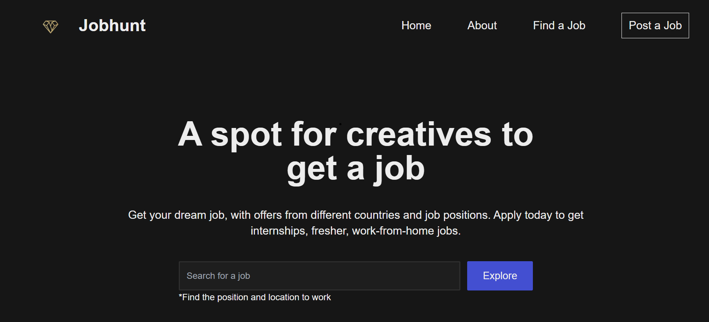
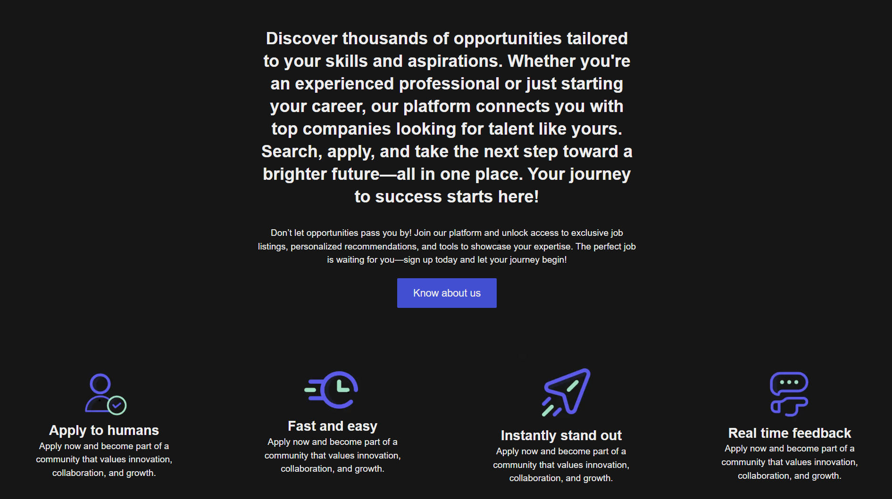

# Jobhunt 

Jobhunt is a modern job listing platform designed to connect employers with top talent. Whether you're looking to post a job, browse available opportunities, or showcase your skills, Jobhunt offers a user-friendly experience to help you achieve your hiring or career goals.

## Features

- **Post Jobs**: Easily post and manage job listings.
- **Job Search**: Browse job listings by category, location, and more.
- **Featured Jobs**: Boost your job listing visibility with the "Featured Job" option.
- **Free Job Posting**: Post jobs for free to reach a wide audience.
- **User Profiles**: Create profiles to highlight your skills and career history.
- **Responsive Design**: Fully optimized for desktop, tablet, and mobile devices.

## Technologies Used

- **Frontend**: Built with [Next.js](https://nextjs.org/) for a fast and scalable user interface.
- **TailwindCSS**: A utility-first CSS framework for custom designs.
- **Redux**: Used for state management.
- **NextAuth**: Authentication system for secure user logins.
- **Font Awesome**: For easy integration of icons across the platform.

